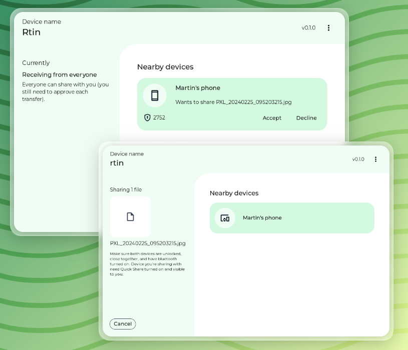

<div align="center">
  <h1>rquickshare</h1>

  <p>
    <strong>NearbyShare/QuickShare for Linux and MacOS</strong>
  </p>
  <p>

[](https://github.com/Martichou/rquickshare/actions)
[](https://github.com/Martichou/rquickshare/actions)

  </p>
</div>



Installation
--------------------------

You simply have to download the latest release.

**Important notes:**
- The minimum GLIBC version supported is included in the pkg name.
  - You can check yours with `ldd --version`.
- RQuickShare is distributed with two version (main & legacy):
  - Legacy is for compatibility with older Ubuntu versions.
  - Main is for future support of newer versions of Ubuntu.

#### macOS

Simply install the .dmg.

Note that you may have to allow the app for installation and first open under `Settings > Privacy & Security > Security` (you should see a dialog asking for permission.)

#### Linux

##### Install dependencies

RQuickShare requires one of the following library installed.

- `libayatana-appindicator`
- `libappindicator3`

The files should (in theory) install those dependencies by themselves, but in case this is not the case you may have to install those manually.

##### Install rquickshare
```bash
sudo dpkg -i r-quick-share_${VERSION}.deb
```

#### Debian
```bash
sudo dpkg -i r-quick-share_${VERSION}.deb
```

#### RPM
```bash
sudo rpm -i r-quick-share-${VERSION}.rpm
```

#### DNF (preferred over RPM)
```bash
sudo dnf install r-quick-share-${VERSION}.rpm
```

#### AppImage (no root required)

AppImage is a little different. There's no installation needed, you simply have to give it the executable permission (+x on a chmod) to run it.

```bash
chmod +x r-quick-share_${VERSION}.AppImage
```

You can then either double click on it, or run it from the cmd line:

```bash
./r-quick-share_${VERSION}.AppImage
```

#### Snap

The snap is not yet on the store, but you can install it with the following (you may need sudo).

```bash
snap install --dangerous r-quick-share_${VERSION}.snap
```

---

<details>
<summary>Unofficial Installation Methods</summary>

#### AUR (Arch)

For Arch Linux, you can install it from the AUR by using an AUR helper like yay.

```bash
yay -S r-quick-share
```

### Nix

Available here: [NixOS](https://search.nixos.org/packages?channel=24.05&show=rquickshare&from=0&size=50&sort=relevance&type=packages&query=rquickshare):

A nix-shell will temporarily modify your $PATH environment variable. This can be used to try a piece of software before deciding to permanently install it.

```bash
$ nix-shell -p rquickshare
```
</details>

---

Limitations
--------------------------

- **Wi-Fi LAN only**. Your devices needs to be on the same network for this app to work.

FAQ
--------------------------

### My Android device doesn't see my laptop

Make sure both your devices are on the same WiFi network. mDNS communication should be allowed on the network; it may not be the case if you're on a public network (coffee shops, airports, ...).

### My laptop doesn't see my Android device

For some reason, Android doesn't broadcast its mDNS service all the time; even when in "Everyone" mode.

The first solution (implemented in RQuickShare for Linux) is to broadcast a bluetooth advertisement so that Android will then make its mDNS available.
Of course, for this you need to have bluetooth on your laptop/desktop. If you don't have that, continue reading.

As a workaround, you can use the "[Files](https://play.google.com/store/apps/details?id=com.google.android.apps.nbu.files)" app on your android device and go to "Nearby Share" tab (if it's not present, continue reading).

A second workaround, you can download a Shortcut maker (see [here](https://xdaforums.com/t/how-to-manually-create-a-homescreen-shortcut-to-a-known-unique-android-activity.4336833)) to create a shortcut to the particular intent:

- Method A:
	- Activity: `com.google.android.gms.nearby.sharing.ReceiveSurfaceActivity`

- Method B:
	- Action: `com.google.android.gms.RECEIVE_NEARBY`
	- Mime type: `*/*`

_Note: Samsung did something shady with Quick Share, so the above workaround may not work. Unfortunately, there's no alternative at the moment. Sorry._

### When sharing a file, my phone appears and disapears "randomly"

TLDR: This is normal if you're just using bluetooth (as explained in the previous point).

Android will see that your laptop/desktop is trying to share a file and will reveal itself. But for some reason Android will de-register its service from time to time and will only then be revealed again once it detect the bluetooth message again.

### Once I close the app, it won't reopen

Make sure the app is really closed by running:

```bash
ps aux | grep r-quick-share
```

If you see that the process is still running, it's because the app is not closed. This may be an intended behavior: when closing the window, the app won't stop and instead is still running and accessible via the system tray icon. But if your distribution doesn't support/don't have enabled them, it may be an issue for you.

If you want to **really** close the app when clicking on the close button, you can change that inside the app by clicking on the three dots and then "Stop app on close".

### My firewall is blocking the connection

In this case, you may want to configure a static port to allow it in your firewall. You can do so by modifying the config file as follow:

```bash
# linux
vim ./.local/share/dev.mandre.rquickshare/.settings.json

# mac
vim Library/Application\ Support/dev.mandre.rquickshare/.settings.json

# to be sure
find $HOME -name ".settings.json"
```

> [!WARNING]
>
> The json must stay valid after your modification, this means if "port" is the last item of the JSON it must not have a comma after it, otherwise the config will be reset.

```json
{
	...existing_config...,
	"port": 12345
}
```

By default the port is random (the OS will decide).

### The app open but I just get a blank window or cannot run it.

This happens for some users running Linux + NVIDIA cards.

The workaround is to start RQuickShare with an env variable defined as follow:

```bash
env WEBKIT_DISABLE_COMPOSITING_MODE=1 rquickshare
```

Also you may use `legacy` variant to figure it.

WIP Notes
--------------------------

`rquickshare` is still in development (WIP) and currently only supports Linux even tho it should be compatible with macOS too. Keep in mind that the design may change between versions, so flexibility is key.

Got feedback or suggestions? We'd love to hear them! Feel free to open an issue and share your thoughts.

Credits
--------------------------

This project wouldn't exist without those amazing open-source project:

- https://github.com/grishka/NearDrop
- https://github.com/vicr123/QNearbyShare


Contributing
--------------------------

Pull requests are welcome. For major changes, please open an issue first to discuss what you would like to change.
