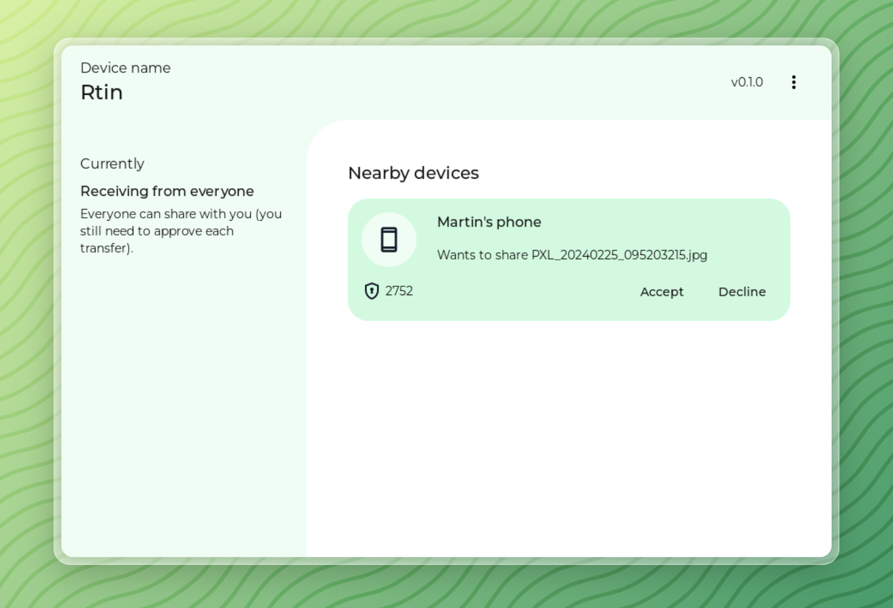

<div align="center">
  <h1>rquickshare</h1>

  <p>
    <strong>NearbyShare/QuickShare for Linux</strong>
  </p>
  <p>

[](https://github.com/Martichou/rquickshare/actions)
[](https://github.com/Martichou/rquickshare/actions)
[](https://github.com/Martichou/rquickshare/actions)

  </p>
</div>



(WIP) How to use
--------------------------

rquickshare offers two options for using its file sharing capabilities: command line (CMD) and a frontend application. However, please note that currently only the CMD mode is functional and limited to receiving files. Sending files from your computer will be implemented later.

#### Cmd line mode

1. Open a terminal.

2. Navigate to the core_lib directory: Replace [path] with the actual installation directory of rquickshare:

	```
	cd [path]/core_lib
	```

3. Run the core service: Launch the application and make your computer discoverable by nearby Android devices:

	```
	cargo run
	```

#### Frontend Application
The frontend application, built with the Tauri framework, is still under development. While you can run it with the following commands, functionality is limited:

1. Install dependencies:

	```
	pnpm install
	```

2. Start development server:

	```
	pnpm dev
	```

Limitations
--------------------------

- **Wi-Fi LAN only**. Your devices needs to be on the same network for this app to work.

- **Visible to everyone** on your network at all times while the app is running.

WIP Notes
--------------------------

`rquickshare` is still in development (WIP) and currently only supports Linux. Keep in mind that the design may change between versions, so flexibility is key.

Got feedback or suggestions? We'd love to hear them! Feel free to open an issue and share your thoughts.


Credits
--------------------------

This project wouldn't exist without those amazing open-source project:

- https://github.com/grishka/NearDrop
- https://github.com/vicr123/QNearbyShare

And of course the code source for NearbyShare and all directly from Google.


Contributing
--------------------------

Pull requests are welcome. For major changes, please open an issue first to discuss what you would like to change.
